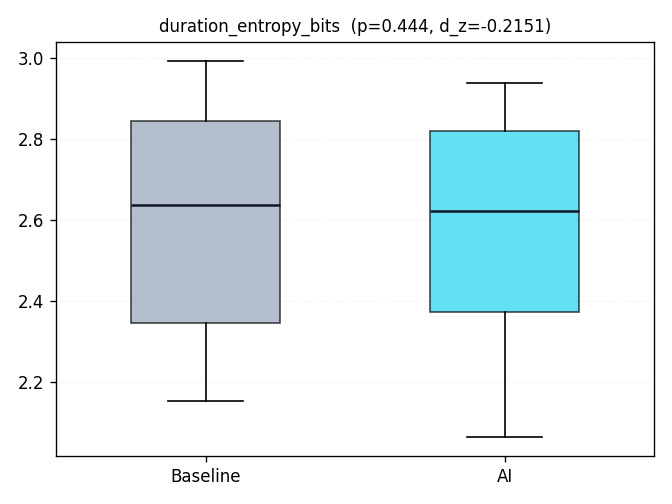
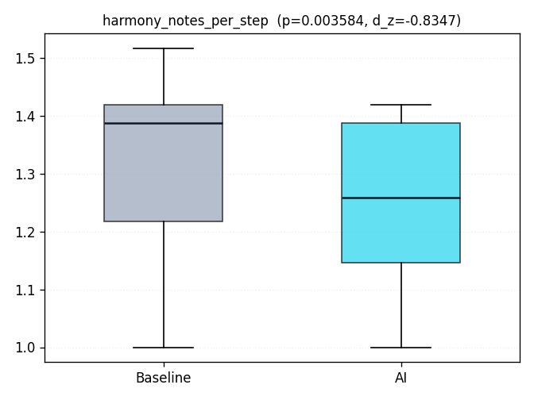
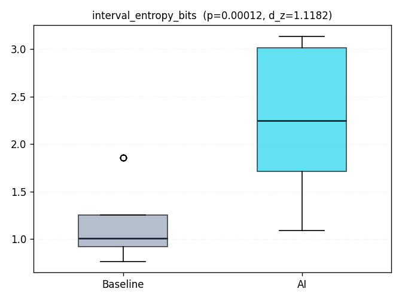
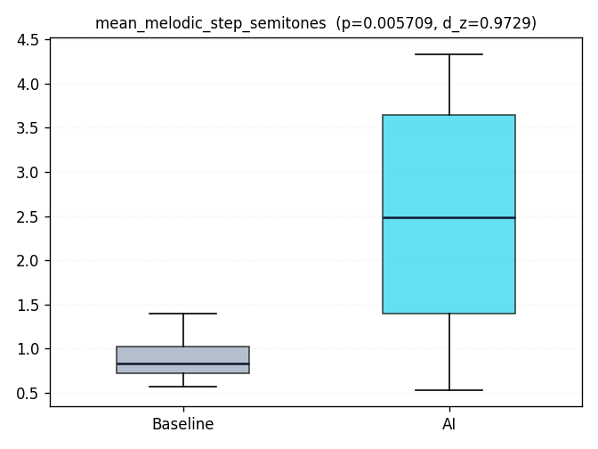
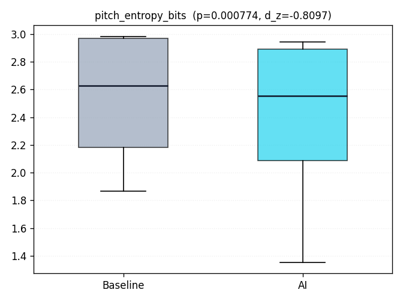
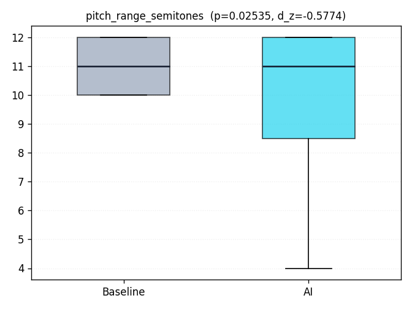
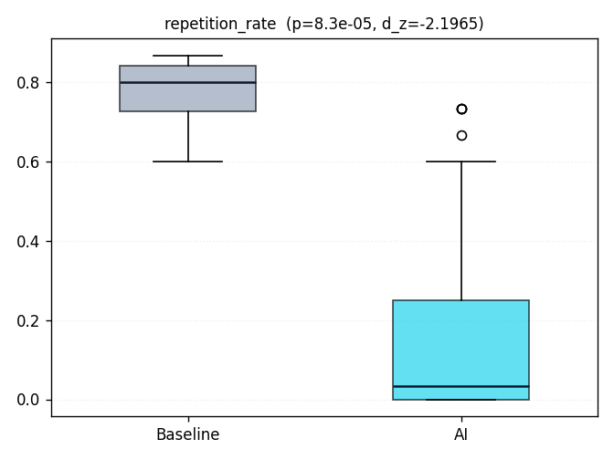
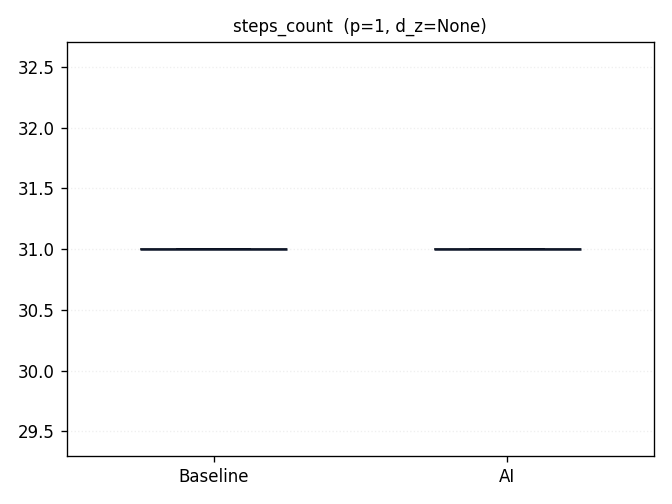
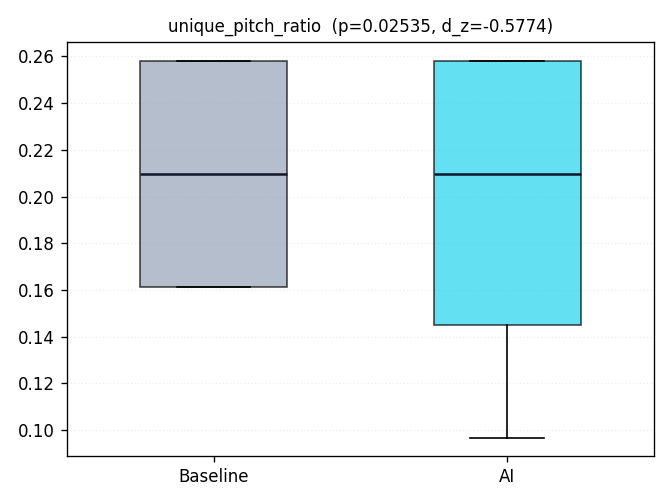

# Baseline vs AI — Statistical Evaluation

This report compares the symbolic sonification metrics produced by the **baseline** (direct physics → note mapping) and the **AI** (transition-scored) branches on the same NASA Horizons windows. Each row of the table below is a Wilcoxon signed-rank test on paired (baseline, AI) values, accompanied by effect-size estimators that are robust to non-normal distributions.

## Setup

- **Planets**: Earth, Mars
- **Styles**: calm, cinematic
- **Seeds**: 7, 13, 19, 23, 42
- **Horizons window (days)**: 30
- **Sample pairs N**: 20
- **Significance α**: 0.05
- **Test backend**: scipy
- **NASA cache hits during run**: 20/20

## Per-metric verdict

| Metric | n | Baseline (μ ± σ) | AI (μ ± σ) | Δ (AI−BL) | W | p-value | d_z | rank-biserial | Direction |
|---|---:|---:|---:|---:|---:|---:|---:|---:|---|
| `duration_entropy_bits` | 20 | 2.5945 ± 0.2829 | 2.5728 ± 0.2791 | -0.0217 | 84.50 | 0.444 | -0.215 | -0.195 | ≈ |
| `harmony_notes_per_step` | 20 | 1.2983 ± 0.1781 | 1.2403 ± 0.1571 | -0.0580 | 2.00 | 0.003584 | -0.835 | -0.949 | BL > AI * |
| `interval_entropy_bits` | 20 | 1.1620 ± 0.4159 | 2.2389 ± 0.7570 | +1.0769 | 2.00 | 0.00012 | 1.118 | 0.981 | AI > BL * |
| `mean_melodic_step_semitones` | 20 | 0.9085 ± 0.3075 | 2.4049 ± 1.3377 | +1.4964 | 31.00 | 0.005709 | 0.973 | 0.705 | AI > BL * |
| `pitch_entropy_bits` | 20 | 2.5264 ± 0.4722 | 2.3683 ± 0.6132 | -0.1580 | 15.00 | 0.000774 | -0.810 | -0.857 | BL > AI * |
| `pitch_range_semitones` | 20 | 11.0000 ± 1.0000 | 9.5000 ± 3.2787 | -1.5000 | 0.00 | 0.02535 | -0.577 | -1.000 | BL > AI * |
| `repetition_rate` | 20 | 0.7667 ± 0.1027 | 0.1983 ± 0.2901 | -0.5684 | 0.00 | 8.3e-05 | -2.196 | -1.000 | BL > AI * |
| `steps_count` | 20 | 31.0000 ± 0.0000 | 31.0000 ± 0.0000 | +0.0000 | — | 1 | — | — | ≈ |
| `unique_pitch_ratio` | 20 | 0.2097 ± 0.0484 | 0.1936 ± 0.0684 | -0.0161 | 0.00 | 0.02535 | -0.577 | -1.000 | BL > AI * |

`*` next to *Direction* marks p-values below the α threshold (statistical significance under matched-pair Wilcoxon).

## Box-plots per metric

## Raw per-pair table

| planet | style | seed | branch | duration_entropy_bits | harmony_notes_per_step | interval_entropy_bits | mean_melodic_step_semitones | pitch_entropy_bits | pitch_range_semitones | repetition_rate | steps_count | unique_pitch_ratio |
|---|---|---|---|---|---|---|---|---|---|---|---|---|
| Earth | calm | 7 | baseline | 2.8372 | 1.4190 | 0.9703 | 0.9000 | 1.8687 | 10.0000 | 0.8333 | 31.0000 | 0.1613 |
| Earth | calm | 7 | ai | 2.8279 | 1.2580 | 1.0912 | 0.5330 | 1.3546 | 4.0000 | 0.7333 | 31.0000 | 0.0968 |
| Earth | calm | 13 | baseline | 2.9920 | 1.4190 | 0.9703 | 0.9000 | 1.8687 | 10.0000 | 0.8333 | 31.0000 | 0.1613 |
| Earth | calm | 13 | ai | 2.7601 | 1.1940 | 1.3629 | 0.8000 | 1.4382 | 4.0000 | 0.6000 | 31.0000 | 0.0968 |
| Earth | calm | 19 | baseline | 2.7885 | 1.3230 | 0.9703 | 0.9000 | 1.8687 | 10.0000 | 0.8333 | 31.0000 | 0.1613 |
| Earth | calm | 19 | ai | 2.9371 | 1.2260 | 1.0912 | 0.5330 | 1.3546 | 4.0000 | 0.7333 | 31.0000 | 0.0968 |
| Earth | calm | 23 | baseline | 2.8049 | 1.4190 | 0.9703 | 0.9000 | 1.8687 | 10.0000 | 0.8333 | 31.0000 | 0.1613 |
| Earth | calm | 23 | ai | 2.8142 | 1.3230 | 1.2419 | 0.6670 | 1.4436 | 4.0000 | 0.6667 | 31.0000 | 0.0968 |
| Earth | calm | 42 | baseline | 2.8531 | 1.3550 | 0.9703 | 0.9000 | 1.8687 | 10.0000 | 0.8333 | 31.0000 | 0.1613 |
| Earth | calm | 42 | ai | 2.8648 | 1.2580 | 1.0912 | 0.5330 | 1.3546 | 4.0000 | 0.7333 | 31.0000 | 0.0968 |
| Earth | cinematic | 7 | baseline | 2.3146 | 1.2900 | 1.8595 | 1.4000 | 2.9668 | 12.0000 | 0.6000 | 31.0000 | 0.2581 |
| Earth | cinematic | 7 | ai | 2.1454 | 1.2580 | 1.9345 | 1.6330 | 2.8161 | 12.0000 | 0.0000 | 31.0000 | 0.2581 |
| Earth | cinematic | 13 | baseline | 2.2104 | 1.3870 | 1.8595 | 1.4000 | 2.9668 | 12.0000 | 0.6000 | 31.0000 | 0.2581 |
| Earth | cinematic | 13 | ai | 2.2315 | 1.4190 | 1.9656 | 1.6000 | 2.7885 | 12.0000 | 0.0000 | 31.0000 | 0.2581 |
| Earth | cinematic | 19 | baseline | 2.2554 | 1.3550 | 1.8595 | 1.4000 | 2.9668 | 12.0000 | 0.6000 | 31.0000 | 0.2581 |
| Earth | cinematic | 19 | ai | 2.4362 | 1.1940 | 1.8323 | 1.7330 | 2.8450 | 12.0000 | 0.0000 | 31.0000 | 0.2581 |
| Earth | cinematic | 23 | baseline | 2.3546 | 1.3870 | 1.8595 | 1.4000 | 2.9668 | 12.0000 | 0.6000 | 31.0000 | 0.2581 |
| Earth | cinematic | 23 | ai | 2.4132 | 1.2580 | 1.8683 | 1.7000 | 2.8852 | 12.0000 | 0.0000 | 31.0000 | 0.2581 |
| Earth | cinematic | 42 | baseline | 2.1519 | 1.3870 | 1.8595 | 1.4000 | 2.9668 | 12.0000 | 0.6000 | 31.0000 | 0.2581 |
| Earth | cinematic | 42 | ai | 2.0620 | 1.3870 | 1.9345 | 1.6330 | 2.8820 | 12.0000 | 0.0000 | 31.0000 | 0.2581 |
| Mars | calm | 7 | baseline | 2.8049 | 1.0000 | 0.7665 | 0.5670 | 2.2874 | 10.0000 | 0.8667 | 31.0000 | 0.1613 |
| Mars | calm | 7 | ai | 2.8097 | 1.0000 | 2.5357 | 3.4000 | 2.3190 | 10.0000 | 0.1000 | 31.0000 | 0.1613 |
| Mars | calm | 13 | baseline | 2.8405 | 1.0000 | 0.7665 | 0.5670 | 2.2874 | 10.0000 | 0.8667 | 31.0000 | 0.1613 |
| Mars | calm | 13 | ai | 2.7615 | 1.0000 | 2.8062 | 3.2330 | 2.3046 | 10.0000 | 0.1333 | 31.0000 | 0.1613 |
| Mars | calm | 19 | baseline | 2.9433 | 1.0000 | 0.7665 | 0.5670 | 2.2874 | 10.0000 | 0.8667 | 31.0000 | 0.1613 |
| Mars | calm | 19 | ai | 2.8662 | 1.0000 | 2.8574 | 3.6330 | 2.3112 | 10.0000 | 0.0667 | 31.0000 | 0.1613 |
| Mars | calm | 23 | baseline | 2.8536 | 1.0000 | 0.7665 | 0.5670 | 2.2874 | 10.0000 | 0.8667 | 31.0000 | 0.1613 |
| Mars | calm | 23 | ai | 2.8937 | 1.0000 | 3.0696 | 3.7670 | 2.3112 | 10.0000 | 0.1333 | 31.0000 | 0.1613 |
| Mars | calm | 42 | baseline | 2.9339 | 1.0000 | 0.7665 | 0.5670 | 2.2874 | 10.0000 | 0.8667 | 31.0000 | 0.1613 |
| Mars | calm | 42 | ai | 2.7989 | 1.0000 | 3.1078 | 4.3330 | 2.3190 | 10.0000 | 0.0333 | 31.0000 | 0.1613 |
| Mars | cinematic | 7 | baseline | 2.3573 | 1.4190 | 1.0518 | 0.7670 | 2.9826 | 12.0000 | 0.7667 | 31.0000 | 0.2581 |
| Mars | cinematic | 7 | ai | 2.3921 | 1.3870 | 3.0159 | 3.8670 | 2.9433 | 12.0000 | 0.0000 | 31.0000 | 0.2581 |
| Mars | cinematic | 13 | baseline | 2.3987 | 1.5160 | 1.0518 | 0.7670 | 2.9826 | 12.0000 | 0.7667 | 31.0000 | 0.2581 |
| Mars | cinematic | 13 | ai | 2.4823 | 1.4190 | 3.0397 | 3.7000 | 2.9339 | 12.0000 | 0.0000 | 31.0000 | 0.2581 |
| Mars | cinematic | 19 | baseline | 2.4823 | 1.4190 | 1.0518 | 0.7670 | 2.9826 | 12.0000 | 0.7667 | 31.0000 | 0.2581 |
| Mars | cinematic | 19 | ai | 2.3479 | 1.4190 | 3.0145 | 3.7330 | 2.9063 | 12.0000 | 0.0000 | 31.0000 | 0.2581 |
| Mars | cinematic | 23 | baseline | 2.2796 | 1.4190 | 1.0518 | 0.7670 | 2.9826 | 12.0000 | 0.7667 | 31.0000 | 0.2581 |
| Mars | cinematic | 23 | ai | 2.2315 | 1.4190 | 3.1362 | 3.6000 | 2.9339 | 12.0000 | 0.0333 | 31.0000 | 0.2581 |
| Mars | cinematic | 42 | baseline | 2.4331 | 1.4520 | 1.0518 | 0.7670 | 2.9826 | 12.0000 | 0.7667 | 31.0000 | 0.2581 |
| Mars | cinematic | 42 | ai | 2.3796 | 1.3870 | 2.7819 | 3.4670 | 2.9221 | 12.0000 | 0.0000 | 31.0000 | 0.2581 |
